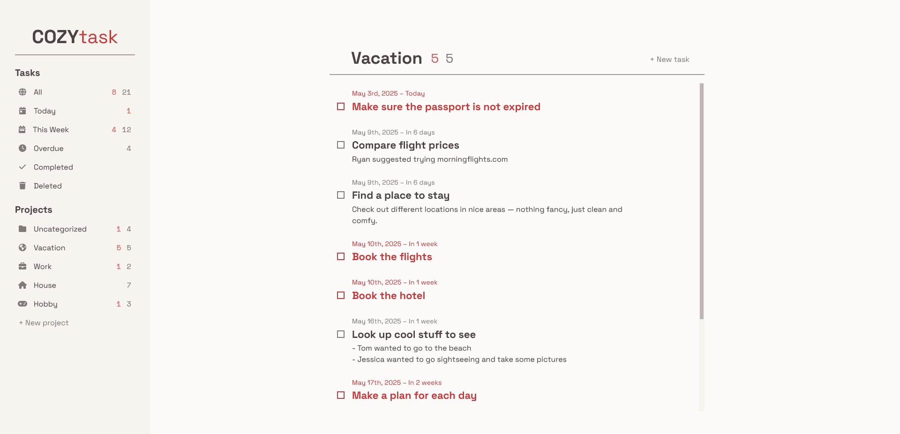

# COZYtask

COZYtask is a task management application designed to help you keep track of your work and projects.

## Features

- **Task Management**: Create and organize tasks with titles, descriptions, due dates, and importance flags. Group related tasks into projects with customizable icons and titles. 
- **Responsive Design**: Works well on both computers and mobile devices.
- **Persistent Storage**: Data saves automatically in the browser.
- **Notifications**: Informative pop-ups appear when you make changes.

## Live Preview

  
  <h3><a href="https://pascard20.github.io/cozy-task/">View Live Demo</a></h3>

## Technologies Used

- **HTML, CSS, JavaScript**
- **Webpack** for asset bundling and optimization
- **DOMPurify** for input sanitization
- **simplebar** for custom scrollbars
- **localStorage** to save data

## Acknowledgments

* Created as part of [The Odin Project](https://www.theodinproject.com/) curriculum.
* Icons by [Font Awesome](https://fontawesome.com/).
* Designed and built by [Łukasz Pasternak](https://github.com/pascard20).
